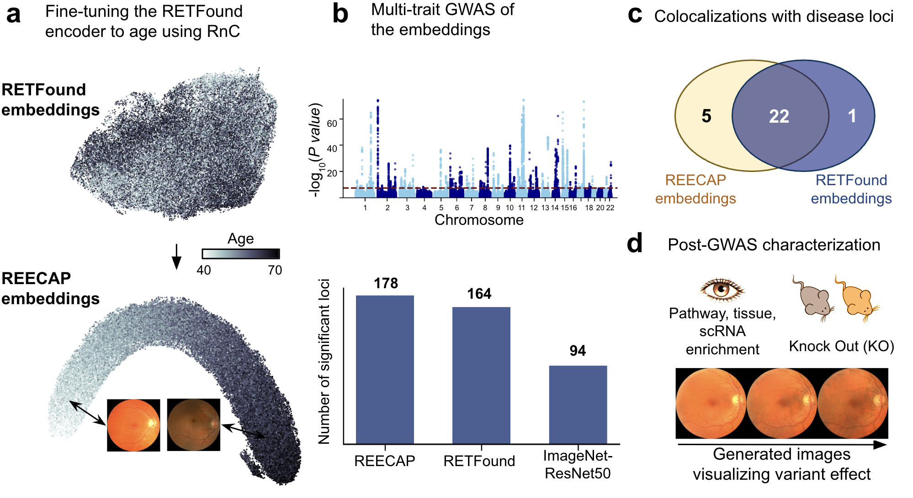

# REECAP Project — Source Code

This repository contains the source code accompanying the paper:

**["REECAP: Contrastive learning of retinal aging reveals genetic loci linking morphology to eye disease"](https://www.medrxiv.org/content/10.1101/2025.11.19.25340555v2)**

The source code integrates **contrastive representation learning**, **generative modeling**, and **genome-wide association analysis**.

<p align="center">
  
</p>

---
## Repository Structure

The repository is organized into **three main stages**, each in its own folder with a dedicated conda environment:

```
.
├── contrastive_training/      # Stage 1: RETFound fine-tuning with RnC loss
│   ├── RETFound_RnC_training/ # Training code
│   └── data/                  # Example images and path table
├── mtgwas/                    # Stage 2: Multi-trait GWAS and LOO prediction
│   ├── mtgwas/                # Python package
│   └── data/                  # Example genotypes, covariates, phenotypes
├── generative_model/          # Stage 3: PGAN training and visualization
│   ├── PGAN/                  # Model, training, and experiment scripts
│   └── data/                  # Example embeddings (.h5ad)
├── concept_figure.png
└── LICENSE
```

Each module is **self-contained**, including its own dependencies and environment setup.

---

## Feature Extraction

### Stage 1 — Contrastive training (`contrastive_training/`)

The [RETFound](https://github.com/rmaphoh/RETFound) ViT-Large encoder is fine-tuned using the [Rank-N-Contrast (RnC)](https://github.com/kaiwenzha/Rank-N-Contrast) loss to predict **age from fundus images**. RnC is a contrastive loss for regression that encourages embeddings of images with similar ages to cluster together.

The encoder produces **1024-dimensional embeddings** per image. These are reduced to **40 dimensions via PCA** and stored as the embedding matrix in an [AnnData](https://anndata.readthedocs.io/) `.h5ad` file, which serves as the shared data format for the downstream stages.

**Key outputs:**
- `best_train_embeddings.csv`, `best_test_embeddings.csv` — per-fold embeddings
- `embeddings.h5ad` — AnnData file with PCA-reduced embeddings and metadata

The code is adapted from:  
- [RETFound Project](https://github.com/rmaphoh/RETFound) — foundation model for retinal image understanding  
- [Rank-N-Contrast](https://github.com/kaiwenzha/Rank-N-Contrast) — contrastive framework for regression tasks  

Download pretrained RETFound weights (`RETFound_mae_natureCFP.pth`) from [HuggingFace](https://huggingface.co/YukunZhou/RETFound_mae_natureCFP) and place in `contrastive_training/data/` before running.

**Environments, Usage, and Example Inputs**
```bash
cd contrastive_training/RETFound_RnC_training
```

- Installation:
```bash
conda env create -f contlearn.yml
conda activate contlearn
```

> **GPU training (Linux + CUDA):** The environment above installs CPU-only PyTorch and works on macOS and Linux. For GPU-accelerated training, opt for:
```bash
conda env create -f contlearn_gpu.yml
conda activate contlearn
```

- Run example (trains on folds 1–4, tests on fold 5; ~2 min on 1× A100):
```bash
python train.py \
    --path_table_file ../data/path_table.csv \
    --train_mode rnc_original \
    --lr 0.00005 \
    --num_epochs 4 \
    --batch_size 4 \
    --aug yes \
    --leave_fold_out 5 \
    --outdir ../data
```

See the README in this folder for data preparation and pretrained weight download instructions.

---

### Stage 2 — Genetic analysis (`mtgwas/`)

The 40-dimensional embeddings are used as multi-trait phenotypes in a **genome-wide association study (GWAS)**. Two analyses are run:

- **Multi-trait GWAS** (`MTGWAS` class) — tests all 40 embedding dimensions jointly against each genetic variant
- **Leave-one-out predictions** (`VCtest.predict_loo`) — for each participant, predicts a scalar score (e.g. disease in 5 years, age, or a genetic variant effect) using a variance component model trained on the remaining samples

The LOO predictions are written back into `adata.obs` in the AnnData file, making them available to the generative visualization stage.

**Key outputs:**
- GWAS p-values, effect sizes, and standard errors
- LOO prediction scores stored in `adata.obs` (e.g. `disease_in5`, `age`, per-variant scores)

**Environments, Usage, and Example Inputs**

> **Note:** This stage is expected to run on a **Linux** environment.

```bash
cd mtgwas
```

- Installation:
```bash
# 1. Create conda environment with pinned scientific stack
conda create -n mtgwas \
  python=3.11 numpy=1.25.2 pandas=2.1.0 scipy=1.11.2 \
  matplotlib=3.7.2 scikit-learn=1.3.0 tqdm=4.66.1 \
  limix-core=1.0.2 chiscore=0.2.2 "setuptools<81" \
  -c conda-forge

# 2. Install PyTorch (CPU)
conda install -n mtgwas pytorch=2.3.0 cpuonly -c pytorch -c conda-forge

# 3. Activate and install pip packages
conda activate mtgwas

cat > /tmp/mtgwas_constraints.txt << 'EOF'
numpy==1.25.2
pandas==2.1.0
scipy==1.11.2
EOF

pip install statsmodels==0.14.0 limix-lmm==0.1.2 -c /tmp/mtgwas_constraints.txt

# 4. Install the package
pip install -e .
```

- Run example (~2 min with 12 CPUs):
```bash
python example_run.py
```

---

### Stage 3 — Generative visualization (`generative_model/`)

A **Progressive GAN (PGAN)** is trained to reconstruct fundus images from their embeddings, conditioned on eye laterality (left/right) and random noise. Once trained, it is used to visualize what biological variation the embedding axes capture, which helps to interpret the initial encoding process and then to visualize possible morphological effects of a genetic veriant.

For a given axis of interest (e.g. LOO-predicted disease in 5 years, age, or a genetic variant effect), participants are ranked by their predicted score. The **top and bottom 0.1%** are identified, and their **mean embeddings** define the two extremes of that axis. The generator then reconstructs images from these extreme embeddings and from **interpolations between them**, producing a visual summary of what retinal morphology changes along the axis.

**Key outputs:**
- Trained PGAN checkpoints (`reecap_s[1-5]_i[16000].pt`)
- Reconstructed and interpolated fundus images for each axis of interest

**Entry points:**
- Training: `generative_model/PGAN/experiments/train_PGAN.py`
- Visualization: `generative_model/PGAN/experiments/reconstruct_disease_in_5_effect.py`

**Environments, Usage, and Example Inputs**
```bash
cd generative_model
```

- Installation:
```bash
conda env create -f genmodel.yml
conda activate PGAN
```

- Run example (train the generative model, ~ 6 hours on Linux, A100 GPU):
```bash
python /PGAN/experiments/train_PGAN.py
```

See [generative_model/PGAN/README.md](generative_model/PGAN/README.md) for visualization and reconstruction scripts.

---

## Data

The original data are from the [UK Biobank](https://www.ukbiobank.ac.uk/) and are not publicly available. Each stage includes **synthetic example data** to allow the pipeline to be tested without access to UKBB. See the `data/README.md` in each folder for details.

---

## Citation

If you use this code, please cite:

```bibtex
@article{shilova2025reecap,
  title   = {REECAP: Contrastive learning of retinal aging reveals genetic loci linking morphology to eye disease},
  author  = {Shilova, Liubov and Sens, Daniel and Aliyeva, Ayshan and Chaudhary, Shubham and Xu, Qiaohan and Salin, Emmanuelle and Schiefelbein, Johannes and Asani, Ben and Amarie, Oana Veronica and Schneltzer, Elida and Segrè, Ayellet V. and Schnabel, Julia A. and Cai, Na and Eskofier, Bjoern M. and Casale, Francesco Paolo},
  journal = {medRxiv},
  year    = {2025},
  doi     = {10.1101/2025.11.19.25340555}
}
```
